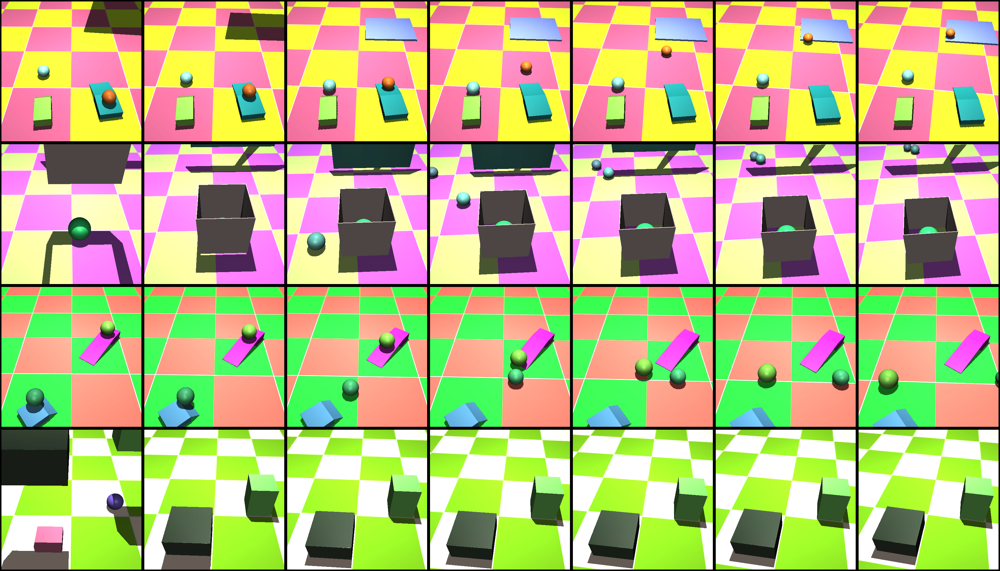
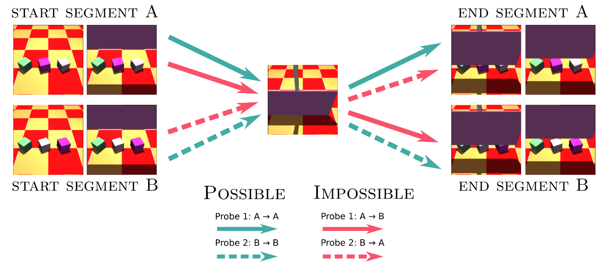

# Physical Concepts Dataset


The Physical Concepts Dataset is a dataset for learning and evaluating intuitive physics inspired by developmental psychology.

See this [Colaboratory notebook](https://colab.research.google.com/github/deepmind/physical_concepts/blob/main/load_physical_concepts_dataset.ipynb) for details on how to load the dataset. [](https://colab.research.google.com/github/deepmind/physical_concepts/blob/main/load_physical_concepts_dataset.ipynb)

The data is available via [Physical Concepts GCP bucket](https://console.cloud.google.com/storage/browser/physical_concepts).

## Dataset Categories

1. The `freeform` category contains videos of unstructured physical events such as collisions. It contains a training set (300,000 videos) and a test set (5,000 videos). The freeform dataset is suitable for training a model.

2. The `probe` category contains five datasets designed to probe one of the five physical concepts listed below.  These probes are inspired by the Violation-of-Expectation paradigm in developmental psychology. Each probe dataset consists of 5,000 `probe quadruplets`. Each quadruplet consists of four videos. The probe datasets are not necessarily suitable for training a model.
 - Continuity
 - Solidity
 - Object Persistence
 - "Unchangeablesness"
 - Directional Inertia

### Data Format

For all datasets, the data consist of videos spanning 15 frames and rendered at a resolution of 64x64 pixels with 3 RGB channels. Each video contains the following keys:
* `image`: rendered image `(shape: 15, 64, 64, 3)`
* `mask`: object segmentation mask `(shape: 15, 64, 64)`
* `camera_pose`: camera orientation and position per frame specified as 6 values `(shape: 15, 6)`:
  *  lookat (x, y, z)
  * distance
  * azimuth
  * elevation

NOTE: The probe datasets make the above keys available as `possible_*` and `impossible_*` e.g. `possible_image` or `possible_mask`.

## Freeform Dataset

This dataset is designed to encompass a wide range of complex physical interactions and includes the following events as basic building blocks.  Each scene is formed by combined two to four of these building blocks:

* rolling
* collisions along the ground plane
* collisions from throwing or dropping an object
* occlusions (via a "curtain" that descends from the top of the screen and retracts)
* object stacks
* covering interactions (an open-bottom, closed-top container falls onto an object)
* containment events (an object falls into an open-top container)

### Primitive shapes:
* rectangular prism
* sphere

### Composite shapes:
* "curtain"
* ramp
* arch
* open-top container
* open bottom contain
We restrict the primitive shapes in our dataset to rectangular prisms and spheres.  From the rectangular prisms we build a "curtain," a ramp, an arch, and both open-top and closed-top cont

### Object properties:
* sizes were chosen in a hand-crafted range to ensure that objects were visible
* colors and the checkerboard floor were chosen as random RGB values
* Objects had varying but stereotyped masses:
  * rolled objects and objects in an object stack had a mass of 10.
  * dropped or thrown objects were made 4 times heavier so that they could more easily displace objects they hit.
  * Containers had a mass of 4 or 5.
  * Arches had a total mass of 60 to keep them upright.

## Physical Concept Probes

These probes were inspired by the violation-of-expectation paradigm for probing intuitive physics knowledge in infants.  The basic idea is to measure surprise (the violation of an expectation) on two types of scenes: physically possible scenes and physically impossible scenes. If an agent is consistently more surprised by impossible physics, then that is taken as evidence of acquisition of the physical concept in question.

One natural concern is that differences in the static visual content of the possible and impossible scenes is responsible for the difference in surprise.  To eliminate this possibility, we generate our probe dataset as `probe quadruplets`.  These consist of two physically possible scenes and two physically impossible scenes. The physically possible scenes contain similar visual content.  To form the physically impossible probes, we swap a segment (see image below) from the first physically possible probe with a segment from the second physically possible probe.  The end result is that the probes contain the two possible probes contain the same exact images as the impossible probes -- the only difference is the order of the frames.



Below we briefly describe the logic underpinning the different physical concept probes, but we strongly encourage readers to read the accompanying manuscript to fully understand what these probes are actually testing.


### Object Persistence

Perhaps the most fundamental aspect of intuitive physics is understanding that objects cannot disappear from existence, and is often called 'object persistence" (or "permanence").  Taking inspiration from a classic behavioral experiment [[1]](#1), probes for this category involve a rigid plank falling on an object.  In the possible probe, when the plank falls on the object, the plank occludes it while also remaining propped up by it as expected.  By contrast, in the impossible probe the plank falls on top of the object (in a manner that is initially identical) but ends up flat on the floor, as if the object had disappeared.  In the counterbalanced probes, the possible probe has the plank falling flat on the floor in an otherwise empty scene, and the impossible probe has the plank falling in the same empty scene but ends up inexplicably propped up by an item that is made to appear under the plank while it occludes part of the floor.


### Unchangeableness

By the principle of "Unchangeableness" [[2]](#2), objects tend to retain their features (e.g., color, shape) over time. In the possible probes of this dataset, a random assortment of static objects are aligned in the foreground.  A screen is lowered in front of those objects, and is then raised.  The concept of 'unchangeableness' relates to a number of different aspects of objects, and therefore in the impossible probes we swap the positions of objects when they are behind the curtain to suggest their position, color, or shape has changed.

### Continuity

The concept that an object traces out one continuous path through space and time is referred to in the developmental literature as "continuity" [[3]](#3).  For videos in this category we use a nearly identical setup to a classic experiment [[4]](#4) where possible probes begin with two static pillars separated by a gap.  A ball is rolled horizontally behind both pillars so that it is visible before, between, and after the pillars during its trajectory.  In the impossible probes, while the ball is occluded by the first pillar, the ball is made invisible for the period when it would be between the pillars, and then reappears after the second pillar.  Alternatively, we make the ball only visible when it is rolling between the pillars, but not before or after.  Note: the splicing procedure for probes for this concept deviates slightly from what is shown above.  However, we still maintain the image-level and pairwise matching of frames across possible and impossible videos in a probe tuple.

### Solidity

This dataset is a recreation of an experiment that uses an object and an occluder [[5]](#5) to test understanding of the solidity of objects, as related to the penetration of an object through a container and the ground below.  In probes, perspective is carefully controlled such that the camera can view inside the top of the container but not the bottom.  In possible probes a rectangular block is dropped into the container and comes to rest as expected.  In the impossible probes, the object "falls through" the container and the floor, and therefore disappears from view (with the penetration itself occluded by the face of the container) even if the object should remain visible due to its height.   Alternatively, the object remains visible when its height clearly dictates it should fall further into the container.  As this involves judging the relative heights of the object and the occluder from memory, we expect this to be quite a challenging dataset.

### Directional Inertia

This dataset is an adaptation of a paradigm developed by Spelke et al [[6]](#6) for investigating infant knowledge of inertia.  Where the classic paradigm investigated both magnitude and directional violations of the principle of inertia, the current probe only tests the directional component.  Possible probes  were formed by rolling a ball at an angle towards a heavy block.  Upon contact, the sphere rolled away from the block while reflecting it's velocity about the angle of incidence (as expected).  The paired possible probe reversed this trajectory: it began at the end point of the first possible probe, rolled at the same location on the block, and bounced off the block to end up at the initial position of the first probe.  Each impossible probe was formed by swapping the trajectories of the impossible probes at the point they make contact with the block.  The effect of this swap was that when the ball hits the block, instead of reflecting about the angle of incidence, it heads back towards its initial location, clearly violating the principles of directional inertia for colliding objects.

## Citation

If you use the dataset, please cite:

```
@inproceedings{
  piloto2020learn:,
  title={Intuitive physics learning in a deep-learning model inspired by developmental psychology},
  author={Luis Piloto and Ari Weinstein and Peter Battaglia and Matthew Botvinick}
  booktitle={TBD},
  year={2022},
  url={TBD}
}
```

## References
<a id ="1">[1]</a>
Baillargeon, R., Spelke, E. S. & Wasserman, S. Object permanence in five-month-old infants. Cognition, 191–208 (1985).
Baillargeon1985

<a id ="2">[2]</a>
Baillargeon, R. & Carey, S. Core cognition and beyond: The acquisition of physical and numerical knowledge. _Early childhood development and later outcome_ 33–65 (2012).

<a id ="3">[3]</a>
Spelke, E. Initial knowledge: six suggestions. _Cognition_, **50**, 431 –  445 (1994).

<a id ="4">[4]</a>
 Aguiar, A. & Baillargeon, R. 2.5-month-old infants’ reasoning about when842objects should and should not be occluded. _Cognitive Psychology_ **39**, 116 – 157 (1999).


<a id ="5">[5]</a>
Hespos,  S.  J.  &  Baillargeon,  R.   Infants’  knowledge  about  occlusion and containment events:  A surprising discrepancy. _Psychological Science_ **12**, 141–147 (2001).

<a id ="6">[6]</a>
Spelke,  E.  S.,  Katz,  G.,  Purcell,  S.  E.,  Ehrlich,  S.  M.  &  Breinlinger,  K. Early knowledge of object motion:  Continuity and inertia. _Cognition_ **51**, 131–176 (1994).

# Dataset Metadata

The following table is necessary for this dataset to be indexed by search
engines such as <a href="https://g.co/datasetsearch">Google Dataset Search</a>.
<div itemscope itemtype="http://schema.org/Dataset">
<table>
  <tr>
    <th>property</th>
    <th>value</th>
  </tr>
  <tr>
    <td>name</td>
    <td><code itemprop="name">Physical Concepts</code></td>
  </tr>
  <tr>
    <td>url</td>
    <td><code itemprop="url">https://github.com/deepmind/physical_concepts</code></td>
  </tr>
  <tr>
    <td>sameAs</td>
    <td><code itemprop="sameAs">https://github.com/deepmind/physical_concepts</code></td>
  </tr>
  <tr>
    <td>description</td>
    <td><code itemprop="description">
      Data accompanying
[Intuitive physics learning in a deep-learning model inspired by developmental psychology]().
      </code></td>
  </tr>
  <tr>
    <td>provider</td>
    <td>
      <div itemscope itemtype="http://schema.org/Organization" itemprop="provider">
        <table>
          <tr>
            <th>property</th>
            <th>value</th>
          </tr>
          <tr>
            <td>name</td>
            <td><code itemprop="name">DeepMind</code></td>
          </tr>
          <tr>
            <td>sameAs</td>
            <td><code itemprop="sameAs">https://en.wikipedia.org/wiki/DeepMind</code></td>
          </tr>
        </table>
      </div>
    </td>
  </tr>
  <tr>
    <td>citation</td>
    <td><code itemprop="citation">TBD</code></td>
  </tr>
</table>
</div>

## License and Disclaimer

Copyright 2022 DeepMind Technologies Limited.

All software is licensed under the Apache License, Version 2.0 (Apache 2.0); you may not use this file except in compliance with the License. You may obtain a copy of the Apache 2.0 license at

[https://www.apache.org/licenses/LICENSE-2.0](https://www.apache.org/licenses/LICENSE-2.0)

All other materials are licensed under the Creative Commons Attribution 4.0 International License (CC-BY).  You may obtain a copy of the CC-BY license at

[https://creativecommons.org/licenses/by/4.0/legalcode](https://creativecommons.org/licenses/by/4.0/legalcode)

Unless required by applicable law or agreed to in writing, all software and materials distributed here under the Apache 2.0 or CC-BY licenses are distributed on an "AS IS" BASIS, WITHOUT WARRANTIES OR CONDITIONS OF ANY KIND, either express or implied. See the licenses for the specific language governing permissions and limitations under those licenses.

This is not an official Google product.
